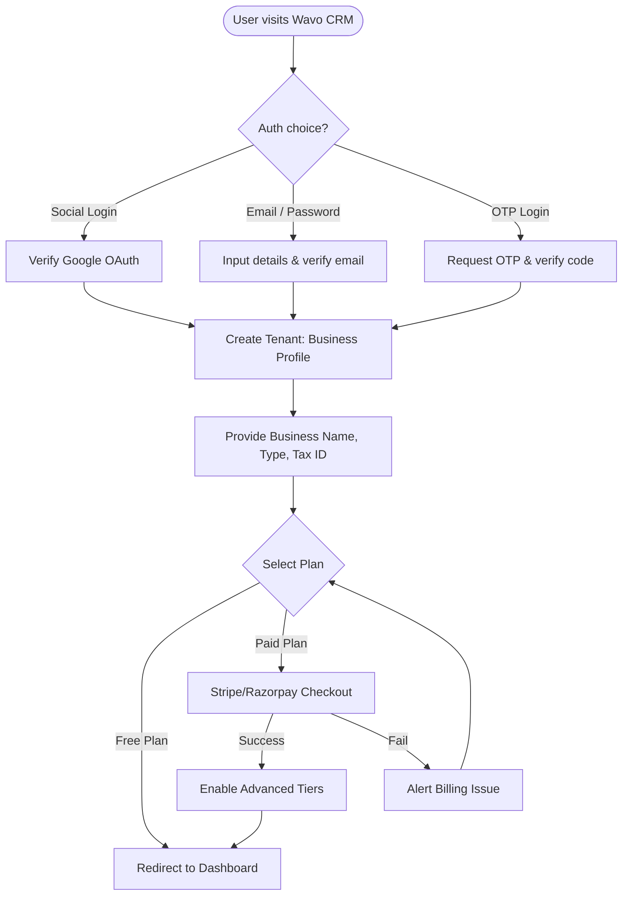
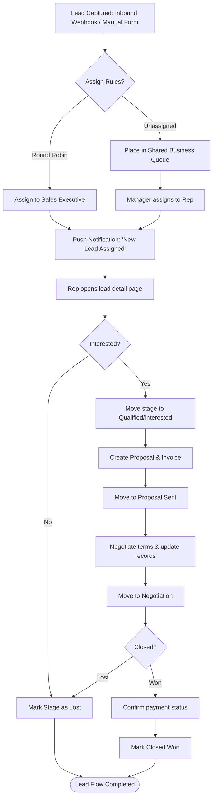
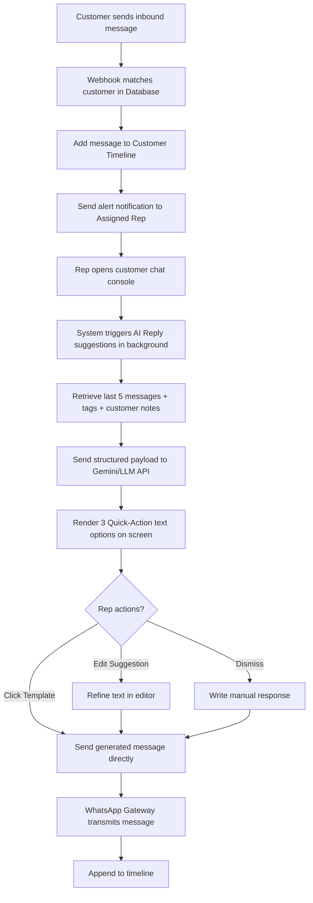

# User Flow Diagrams - Wavo CRM

This document contains Mermaid diagrams detailing the main user journeys across Wavo CRM: onboarding, lead progression, campaign broadcasting, and AI actions.

---

## 1. Business Owner Registration & Onboarding Flow
Describes the path a new business owner takes to register an account, create their business tenant, choose a subscription, and configure settings.



---

## 2. Lead Management & Sales Pipeline Transition
Maps how leads are captured, assigned, moved through the Kanban pipeline, and eventually won or lost.



---

## 3. WhatsApp Campaign Broadcast Flow
Flow illustrating how a Manager creates and triggers a bulk marketing/alert campaign targeting a subset of customers.

```mermaid
flowchart TD
    ManagerDash([Manager Dashboard]) --> SelectTemplates[Select Pre-approved WhatsApp Template]
    SelectTemplates --> SelectAudience[Filter Customer List by Tags e.g., 'VIP']
    SelectAudience --> SetupVars[Configure template variable replacements]
    SetupVars --> PreviewBroadcast[Preview sample message render]
    
    PreviewBroadcast --> RunLimitsCheck{Daily quota validation?}
    RunLimitsCheck -- Exceeded --> AlertLimit[Display warning: Reduce recipient count or upgrade plan] --> SelectAudience
    RunLimitsCheck -- Valid --> ConfirmTrigger[Approve Broadcast campaign]
    
    ConfirmTrigger --> PushToBullMQ[Push message objects to BullMQ Queue in Redis]
    
    subgraph Background Queue worker (Rate Limiting)
        PushToBullMQ --> FetchJobs[Worker pulls batch from queue]
        FetchJobs --> CallWhatsAppAPI[Post data to Meta WhatsApp API]
        CallWhatsAppAPI --> UpdateStatus[Update message status: Sent / Delivered / Read]
    end
    
    UpdateStatus --> CompleteBroadcast([Broadcast Complete & Reports updated])
```

---

## 4. AI-Powered Follow-up and Reply Workflow
Flow mapping how incoming WhatsApp customer messages leverage LLM endpoints to assist the Sales representative.


